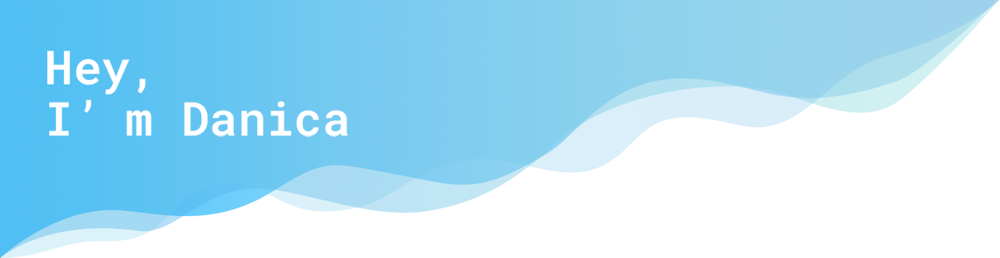

<code>
  🐍 <b>print</b>("I kick-started my technology journey by self-learning online specialisation courses in Python.")
</code>

<code>
🎓 <b>document.write</b>("Then attended university for further education in computing discipline, and accomplished with an overall A grade.")
</code>

<code>
🥳 <b>const danica = new WebDeveloper</b>("I continue sharpening my skills in React.js", "Open to Work", "Entry Level")
</code>

 
<h2 align="center"> My Skill Set </h2>

&nbsp;&nbsp;
&nbsp;&nbsp;
&nbsp;&nbsp;
&nbsp;&nbsp;
&nbsp;&nbsp;
&nbsp;&nbsp;
&nbsp;&nbsp;
&nbsp;&nbsp;
&nbsp;&nbsp;
&nbsp;&nbsp;
&nbsp;&nbsp;
&nbsp;&nbsp;
&nbsp;&nbsp;
&nbsp;&nbsp;
&nbsp;&nbsp;

<h2 align="center">Keep Learning More</h2>

 

<code>
  👋 <b>window.confirm</b>("Connect with me.")
</code>

&nbsp;&nbsp;
&nbsp;&nbsp;
&nbsp;&nbsp;

<!-- <a href="https://icons8.com/icon/118553/github">icon by Icons8</a> -->

 

